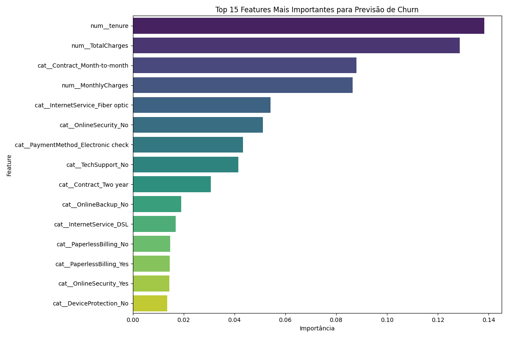

# Projeto de Previsão de Churn: Pipeline de ML com Deploy via API e Docker


Este repositório contém um projeto de Machine Learning de ponta a ponta que vai além da simples modelagem. Ele implementa um pipeline de MLOps completo, desde a análise exploratória e treinamento rastreável com **MLflow**, até o deploy do modelo como uma **API REST com FastAPI**, containerizada com **Docker**.

## 📝 Contexto do Problema de Negócio

A aquisição de novos clientes é significativamente mais cara do que a retenção dos clientes existentes. O objetivo deste projeto é construir um modelo de classificação capaz de identificar clientes com alta probabilidade de cancelar seus serviços (churn), permitindo que a empresa tome ações proativas para retê-los.

O dataset utilizado foi o [Telco Customer Churn](https://www.kaggle.com/datasets/blastchar/telco-customer-churn) da IBM.

---

## ✨ Funcionalidades do Projeto

Este projeto demonstra um fluxo de trabalho completo e moderno de Data Science:

*   **Pipeline de Treinamento Reprodutível:** Scripts modulares para ingestão, pré-processamento e treinamento.
*   **Rastreamento de Experimentos:** Integração com **MLflow** para logar parâmetros, métricas e artefatos (modelo e gráficos), garantindo a rastreabilidade e comparação de diferentes execuções.
*   **API de Inferência:** Uma API RESTful construída com **FastAPI** para servir o modelo e fazer previsões em tempo real.
*   **Containerização:** Um **Dockerfile** para empacotar a API e suas dependências, garantindo um ambiente de execução consistente e portátil.
*   **Documentação Interativa:** Geração automática de documentação da API (Swagger UI) pelo FastAPI.

---

## 🚀 Como Executar o Projeto

Existem duas maneiras de executar este projeto: localmente via API ou de forma isolada via contêiner Docker.

### Método 1: Execução com Docker (Recomendado)

Esta é a maneira mais simples e robusta, pois abstrai toda a configuração de ambiente.

**Pré-requisitos:**
*   [Docker Desktop](https://www.docker.com/products/docker-desktop/) instalado e em execução.

**Passos:**

1.  **Clone o repositório:**
    ```bash
    git clone https://github.com/rianemilio/churn-prediction.git
    cd projeto-previsao-churn
    ```
2.  **Construa a imagem Docker:**
    ```bash
    docker build -t previsao-churn-api .
    ```
3.  **Execute o contêiner:**
    ```bash
    docker run -p 8000:8000 previsao-churn-api
    ```
4.  **Acesse a API:** Abra seu navegador e acesse a documentação interativa em `http://127.0.0.1:8000/docs`.

### Método 2: Execução Local (Pipeline de Treinamento)

Use este método se você quiser executar o pipeline de treinamento para gerar os artefatos (modelo, gráficos, etc.).

**Pré-requisitos:**
*   Git
*   Python 3.9+

**Passos:**

1.  **Clone o repositório e configure o ambiente:**
    ```bash
    git clone https://github.com/SEU_USUARIO/projeto-previsao-churn.git
    cd projeto-previsao-churn
    python -m venv venv
    source venv/bin/activate  # (ou venv\Scripts\activate no Windows)
    pip install -r requirements.txt
    ```
2.  **Execute o pipeline de treinamento:**
    ```bash
    python main.py
    ```
    Isso irá gerar os artefatos nas pastas `output/` e `mlruns/`.

3.  **(Opcional) Inicie a interface do MLflow:**
    ```bash
    mlflow ui
    ```
    Acesse `http://127.0.0.1:5000` para visualizar os experimentos.

---

## 📂 Estrutura do Projeto

```
projeto-previsao-churn/
├── api/                     # Código da API FastAPI
│   ├── main.py
│   └── schemas.py
├── data/                    # Dataset
├── output/                  # Artefatos gerados (modelos, imagens)
├── src/                     # Código do pipeline de treinamento
│   ├── data_ingestion.py
│   ├── exploratory_analysis.py
│   ├── data_preprocessing.py
│   └── model_training.py
├── .dockerignore
├── .gitignore
├── config.py
├── Dockerfile               # Receita para construir a imagem Docker
├── main.py                  # Orquestrador do pipeline de treino
├── README.md
└── requirements.txt
```

---

## 📊 Resultados e Insights

### Análise Exploratória

*   **Fatores de Risco:** A análise revelou que clientes com **contrato mensal**, **baixa fidelidade (tenure)** e **serviço de internet de Fibra Óptica** são os que possuem as maiores taxas de churn.

*   **Feature Importance:** O modelo `RandomForest` confirmou que as features mais preditivas são, de fato, `Contract_Month-to-month`, `tenure` e `TotalCharges`.
    

### Performance do Modelo

O modelo treinado alcançou os seguintes resultados no conjunto de teste, que foram logados no MLflow:

```
--- Resultados da Avaliação ---
Acurácia do Modelo: 0.7786

Relatório de Classificação:
              precision    recall  f1-score   support

           0       0.82      0.89      0.85      1035
           1       0.61      0.48      0.53       374

    accuracy                           0.78      1409
   macro avg       0.71      0.68      0.69      1409
weighted avg       0.77      0.78      0.77      1409
```
**Conclusão dos Resultados:** Com uma acurácia de **77.9%** e um recall de **48%** para a classe "Churn", o modelo é uma ferramenta valiosa para identificar um subgrupo significativo de clientes em risco, permitindo que a equipe de retenção foque seus esforços de forma eficaz.
