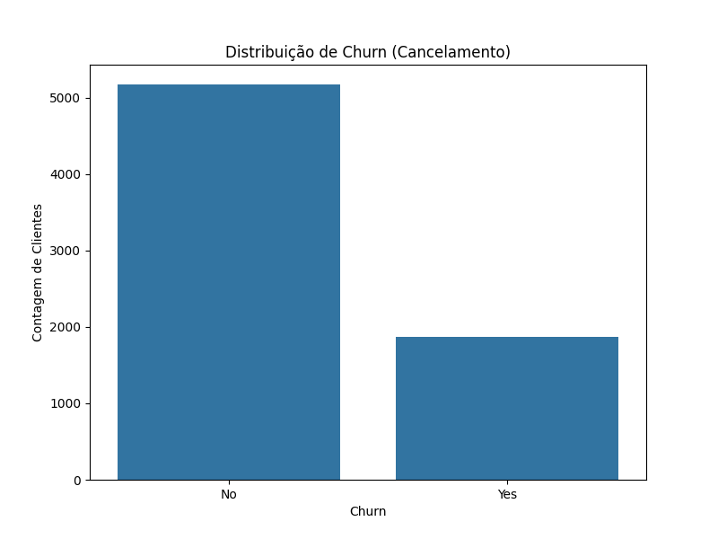
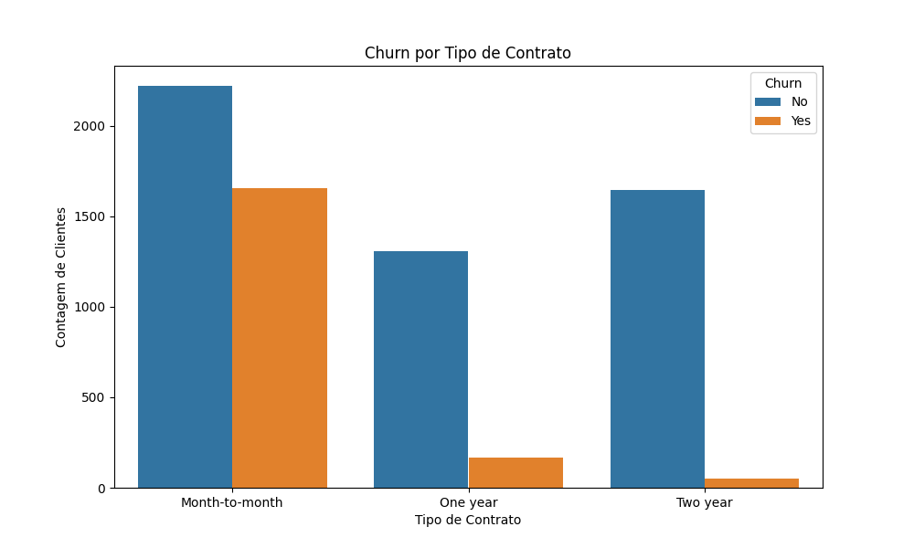

# Projeto de Previsão de Churn (Cancelamento de Clientes)


Este repositório contém um projeto de Machine Learning de ponta a ponta para prever a probabilidade de clientes de uma empresa de telecomunicações cancelarem seus serviços (churn). O projeto foi desenvolvido de forma modular e segue boas práticas de engenharia de software, com o objetivo de ser um pipeline de dados reprodutível e fácil de entender.

## 📝 Contexto do Problema de Negócio

A aquisição de novos clientes é significativamente mais cara do que a retenção dos clientes existentes. Para empresas de serviços por assinatura, como as de telecomunicações, prever quais clientes estão em risco de cancelar seus contratos é crucial.

O objetivo deste projeto é construir um modelo de classificação capaz de identificar clientes com alta probabilidade de churn, permitindo que a empresa tome ações proativas para retê-los, como oferecer descontos, suporte personalizado ou melhorias no serviço.

O dataset utilizado foi o [Telco Customer Churn](https://www.kaggle.com/datasets/blastchar/telco-customer-churn) da IBM, disponível no Kaggle.

---

## 🚀 Como Executar o Projeto

Para executar o pipeline completo em sua máquina local, siga os passos abaixo.

### Pré-requisitos
*   Git
*   Python 3.8+

### Passos

1.  **Clone o repositório:**
    ```bash
    git clone https://github.com/SEU_USUARIO/projeto-previsao-churn.git
    cd projeto-previsao-churn
    ```

2.  **Crie e ative um ambiente virtual:**
    ```bash
    # Para Mac/Linux
    python3 -m venv venv
    source venv/bin/activate

    # Para Windows
    python -m venv venv
    venv\Scripts\activate
    ```

3.  **Instale as dependências:**
    ```bash
    pip install -r requirements.txt
    ```

4.  **Execute o pipeline principal:**
    ```bash
    python main.py
    ```

Ao final da execução, o modelo treinado (`churn_model.joblib`) e os gráficos da análise exploratória estarão salvos na pasta `output/`.

---

## 📂 Estrutura do Projeto

O projeto foi organizado de forma modular para garantir a separação de responsabilidades e facilitar a manutenção e escalabilidade.

```
projeto-previsao-churn/
├── .gitignore
├── README.md
├── requirements.txt
├── config.py                # Arquivo de configuração central
├── main.py                  # Orquestrador do pipeline
├── data/
│   └── ...csv               # Dados brutos
├── src/
│   ├── data_ingestion.py    # Módulo para carregar dados
│   ├── exploratory_analysis.py # Módulo para análise exploratória
│   ├── data_preprocessing.py   # Módulo para pré-processamento
│   └── model_training.py       # Módulo para treinamento do modelo
└── output/
    ├── images/              # Gráficos gerados pela EDA
    └── models/              # Modelo treinado salvo
```

---

## 🛠️ O Pipeline de Machine Learning

O script `main.py` orquestra a execução das seguintes etapas:

1.  **Ingestão de Dados:** Carrega o dataset a partir do arquivo CSV especificado em `config.py`.
2.  **Análise Exploratória de Dados (EDA):** Gera e salva visualizações para entender a distribuição dos dados e as relações entre as features e a variável alvo (Churn).
3.  **Pré-processamento e Engenharia de Features:** Limpa os dados, trata valores faltantes e transforma as features categóricas e numéricas para um formato adequado para o modelo de Machine Learning, utilizando um pipeline do Scikit-learn.
4.  **Treinamento e Avaliação do Modelo:** Divide os dados em conjuntos de treino e teste, treina um modelo `RandomForestClassifier` e avalia sua performance com métricas como acurácia, precisão, recall e F1-score. O modelo treinado é então salvo para uso futuro.

---

## 📊 Resultados e Insights

### Análise Exploratória

A análise inicial revelou insights importantes sobre o perfil dos clientes que cancelam:

*   **Distribuição de Churn:** O dataset é desbalanceado, com uma proporção maior de clientes que não cancelaram o serviço. Isso foi considerado durante a divisão treino-teste (estratificação).
    

*   **Churn por Tipo de Contrato:** Clientes com contrato mensal (`Month-to-month`) têm uma taxa de cancelamento drasticamente maior em comparação com clientes de contratos anuais. Isso sugere que a flexibilidade do contrato mensal também representa um risco maior de churn.
    

### Performance do Modelo

O modelo `RandomForestClassifier` treinado alcançou os seguintes resultados no conjunto de teste:

```
--- Resultados da Avaliação ---
Acurácia do Modelo: 0.7786

Relatório de Classificação:
              precision    recall  f1-score   support

           0       0.82      0.89      0.85      1035
           1       0.61      0.48      0.53       374

    accuracy                           0.78      1409
   macro avg       0.71      0.68      0.69      1409
weighted avg       0.77      0.78      0.77      1409
```

**Conclusão dos Resultados:**
*   O modelo tem uma **acurácia geral de 77.9%**.
*   Ele é bom em identificar os clientes que **NÃO** vão cancelar (recall de 89% para a classe 0).
*   O maior desafio é identificar corretamente os clientes que **VÃO** cancelar. O **recall de 48% para a classe 1** indica que o modelo consegue identificar quase metade dos clientes que de fato cancelaram, o que já permite uma ação de retenção direcionada e valiosa.

---
